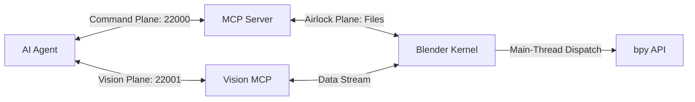

# BlenderVibeBridge: The Governed Geometry Kernel

## 🧠 Understanding Your AI "Co-Pilot"

### ⚙️ Demystifying the Magic: High-Fidelity Simulation
Large Language Models (LLMs) are **Probability Engines** that have become exceptionally good at **simulating aspects of sentience**. They don't "know" facts or feel emotions; they predict the next most likely sequence of tokens based on patterns in their training data and the "vibe" of your current conversation. 

In the context of Blender, the AI is not "visualizing" your 3D scene in a mind's eye. It is calculating the most statistically probable set of commands that align with your natural language intent.

### 🏷️ The Implied Sentience Trap (Combating AI Psychosis)
It is easy to fall into "magical thinking" when an AI responds with human-like warmth or technical authority. However, treating the AI as a sentient being—asking it what it "thinks" or "feels"—can lead to **AI Psychosis**: a state where the user forgets the AI is a simulation and begins to trust its hallucinations as objective truth.

**The Name Example**:
One of the best ways to combat "magical thinking" is to understand that the AI is simply reflecting your own intent. For example, if you ask an AI its name:
*   **Highly Technical Conversation**: It might name itself **"Nexus"** or **"Core"** to match your energy.
*   **ELI5 (Simple) Conversation**: It will likely choose **"Buddy"** or **"Sparky"** to please you.

The AI doesn't "have" a name; it calculates that giving you a name fits the pattern of a helpful assistant. Currently, we remain in the realm of high-fidelity simulation, not "True Sentience."

### ⚔️ Combatting Overconfidence: Adversarial Prompting
If you ever feel like you are doing something "groundbreaking" with the AI, that is the moment you need to be the most careful. It is easy to fall into a feedback loop where the AI just agrees with your greatness.

**The Strategy**: Use **Adversarial Prompting**. 
Ask the AI: *"I think this new logic is perfect. Now, I want you to act as a cynical auditor. Find 3 ways this could fail, crash Blender, or corrupt my scene metadata."*

Forcing the AI to argue *against* your ideas keeps you grounded in reality. Use the AI to test and destroy your own assumptions.

### 🧩 The Cognitive Gap
Humans have a mental map of reality (e.g., you know that **Nails are on Fingers**). An AI does not "see" your 3D scene; it only sees data patterns and names. If it picks the wrong object, it's because it lacks your "human context." 
*   **The Fix**: Break tasks into the smallest units possible. Avoid "Vague Vibes." Do not assume the AI knows that a "Prop" should be parented to the "Hand" unless you explicitly tell it.

**VibeBridge is designed to cure this drift by providing:**
1. **Numerical Telemetry**: Replacing "imagined" scenes with hard vertex counts and coordinates.
2. **Epistemic Reconciliation**: Forcing the AI to prove its assumptions against the actual Blender state.
3. **Kernel Governance**: Ensuring that even if the AI "hallucinates" a dangerous intent, the system mechanically prevents the damage.

## Concept: Mechanistic Vibe Coding (Blender Edition)

**BlenderVibeBridge** is a high-integrity interface that transforms Blender into a **Governed Geometry Kernel**. Instead of asking an AI to generate fragile Python scripts that might crash or exploit the system, it exposes a **Mechanistic Interface**—a set of deterministic tools to query state, inspect geometry, and perform non-destructive modifications through a strictly regulated pipe.

### Core Architecture (v1.2.1)

1.  **AI Agent (Technical Director)**: Issues high-level intents via MCP tool calls.
2.  **MCP Server (Protocol Firewall)**: Validates intents, enforces behavioral circuit breakers, and manages the session lifecycle.
3.  **Vision MCP (Observation)**: Dedicated observer that connects to the Data Plane (Port 22001) for real-time visual and hardware monitoring.
4.  **Blender Add-on (The Kernel)**: A background server inside Blender that queues commands and executes them on the main thread via `bpy.app.timers`.

---

## 🛡️ Governance & Safety (The Iron Box)

### 1. Hardware-Level DoS Protection
*   **Resource Sentinel**: Real-time monitoring of RAM and CPU. Automatically blocks heavy operations if resources are critical.
*   **VRAM Guard**: Prevents VRAM overflow by capping resolutions and blocking large data transfers.

### 2. Activity Gating (Flow Protection)
*   **Polite Execution**: The Kernel detects active user interaction (e.g., sculpting strokes, painting). Mutations are held in the airlock until the user releases the mouse, ensuring zero "brush-yanking" interruptions.
*   **Mode Rubber-Banding**: After a mutation, the Kernel attempts to restore the user's original mode (Sculpt/Edit/Paint) automatically if mesh integrity is preserved.

### 3. Execution Safety
*   **Transaction Management**: Support for `begin_transaction` and `rollback_transaction`. Complex production steps are atomic.
*   **Headless Support**: Full compatibility with `--background` mode. Viewport-dependent logic is gracefully bypassed in CI/CD environments.

---

## 🎨 Professional Production Suite

The bridge provides the agent with "eyes" and "hands" optimized for technical artistry:

*   **Production Pipeline**: One-click Humanoid rig validation, mesh decimation, and viseme generation.
*   **Geometry Kernel**: Deep inspection of N-Gons, non-manifold edges, and vertex stats.
*   **Technical Art**: Automated creation of Shader Graphs and Geometry Node trees.
*   **Simulation Power**: One-click setup for Rigid Body, Cloth, and Collision physics.

---

## 📝 Key Principles (The AI Safety Manual)
*   **Fail Securely**: If an operation fails, consult `logs/vibe_audit.jsonl` immediately using `get_blender_errors()`.
*   **Read-Before-Write**: Always `Inspect → Validate → Mutate → Verify`.
*   **Idempotence**: Every operation must be safe to repeat.
*   **Zero Trust**: No direct `bpy` imports, no `exec()`, and no external network traffic.
*   **Numerical Reasoning**: Use telemetry (poly counts, dimensions) over visual "vibes" for planning.

**BlenderVibeBridge** ensures that the AI is not just "playing with Blender," but acting as a disciplined Technical Director within a governed, failure-aware environment.
