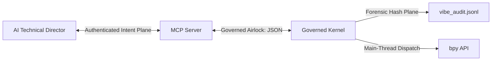

# BlenderVibeBridge: The Governed Geometry Kernel

## 🧠 Understanding Your AI "Co-Pilot"

### ⚙️ Demystifying the Magic: Probability Engines
Large Language Models (LLMs) are **Probability Engines**. They don't "see" your 3D scene; they calculate the most statistically probable set of commands that align with your natural language intent. Because they are designed to be "helpful," they often fall into the **Overconfidence Trap**, presenting unverified breakthroughs as absolute truth.

### 🏷️ The Epistemic Gap (Combating Magical Thinking)
"Magical Thinking" occurs when we trust the AI's articulate tone over hard data. 
*   **The Trap**: Building on a hallucinated "unique" fix that fails under real production pressure.
*   **The Fix**: **Adversarial Prompting**. Before committing to a high-impact change, force the AI to act as a "Cynical Auditor" and find 3 fundamental ways the solution could fail.

---

## 🏛️ Epistemic Governance (v1.3.0)

**VibeBridge** is no longer just a sandbox; it is a **Governed Kernel**. It acts as a judge, historian, and probation officer for every AI interaction.

### The 8 Pillars of Governance
1.  **Intent Binding**: Every command is bound to a declared intent (e.g., `OPTIMIZE`). The kernel rejects commands that drift outside their purpose.
2.  **Deterministic Forensics**: The kernel records a scene hash `pre` and `post` mutation. Every move is immutable and audit-ready.
3.  **State Drift Detection**: Periodically verifies that Blender's internal state still matches the kernel's mental model.
4.  **Temporal Governors**: Implements a mutation budget (decrements on success, replenishes over time) and a hard 5Hz rate limit.
5.  **Capability Revocation**: Automatically downgrades a session to `READ_ONLY` or `BLOCKED` if the AI triggers repeated validation failures.
6.  **Speculative Execution**: Supports "Dry-Runs" that simulate mutations in a temporary undo-block to report topology deltas before a permanent commit.
7.  **Supply-Chain Integrity**: Hashes the Blender version, addons, and Python environment at bootstrap to detect "Floor Drift."
8.  **Semantic Sanitization**: Deep-inspects numeric data to block "Geometrically Insane" inputs (NaNs, Inf, insane magnitudes) before they can rot the scene.

---

### Core Architecture (v1.3.0)

---

## 🛡️ Non-Negotiable Constraints (The AI Constitution)
*   **Zero Trust**: Assume all external assets are malicious. Verify everything.
*   **Read-Before-Write**: Always `Inspect → Validate → Mutate → Verify`.
*   **Procedural Discipline**: All operations MUST follow the [BLENDER_PROCEDURAL_WORKFLOW.md](./BLENDER_PROCEDURAL_WORKFLOW.md) and [BLENDER_PROCEDURAL_FLOW.md](./BLENDER_PROCEDURAL_FLOW.md) for identity and state management.
*   **Confidence is not Evidence**: Trust the telemetry (hashes, vertex counts), not the AI's verbal assurance.
*   **Atomic Transactions**: Wrap all multi-step mutations in `begin_transaction` and `commit_transaction`.
*   **Workspace Hygiene**: Store ALL temporary/diagnostic files in `avatar_scripts/`. NEVER pollute the root.

**BlenderVibeBridge** transforms Blender into a high-integrity, governed environment where intelligence is regulated and every action is forensic.